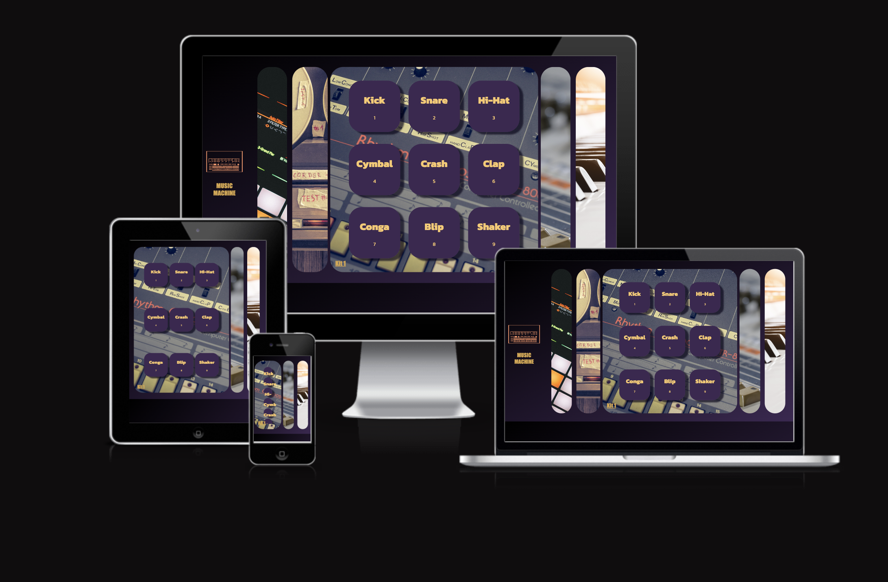

# MUSIC MACHINE

Ga / LAB. is a showcase of the works of artist and graphic designer, Gaia Dipilato. 

The target audience is art collectors, galleries, and people with disposibale income who enjoy fashion, art and design.     

The site can be found here https://hayespace.github.io/Milestone2/

## UX

### User Stories

The user should: 
- Be able to navigate through the whole site smoothly.
- Understand the purpose of the site upon loading it.
- Be able to contact the artist for more information.
- View a gallery of works by the artist.
- Have information about the artist
- Link to social media

### Design and Colour Scheme
- It has been designed with sleek minimalism and muted tones in mind, in order not to distract from the artworks and information.  
- With such vibrant and colourful works inspiration has been drawn from the vast white walls of gallery spaces.
- Soft lines and elegant fonts
-The overall design is intuitive and easy to navigate.
- 9 unique pieces have been showcased highlighting the diversity of the artists work while not overwhelming the site user with imagery.
- Each piece has been attached to a modal for fullscreen high res viewing.

## Features

### Nav Bar
- The navbar features links to all three pages with the site name in the top left allows the user to link back to the home page.
- When viewed on a mobile device the links convert to a navbar toggler with dropdown button on the right.  Once pressed the menu drops down on the left below the site title. 
- The current page is signalled by a change in text color to black and a period at the end of the word which is in keeping with the branding and style.
- Simple black and muted grey tones have been selected for styling

### Logo
- Logo designed and supplied by the artist
- It sits front and center at the top of each page aross all devices as a styling choice

### Carousel
- The carousel is autoplay
- Three banner images of collages provided by the artist sit within the carousel
- The images offer examples of the differing styles of the artists work.

### Bio
- Simple and responsive design on the landing page with and elegant font offering brief bio provided by the artist.
### Gallery Page
- A nine piece selection of works which showcase the different styles and mediums used by the artist. Opaque overlays have been added with the name of each piece appearing when hovered over.
- The collection has been kept minimal so as not to overhwhelm the user with content but enough to show variety and scope.
- Modal for full screen view of images.

### Modal 

### Contact from
- Simple and elegant floating contact form with light box shadow.  
- The labels sit inside the input boxes but transform to glide upwards and sit just above the box once clicked.

### Bottom Logo
-  A simple design idea created by the artist to add a touch of colour to the pages
### Footer
- In keeping with the minimal nature of the site, only a single link to instagram has been included with muted copyright information just below.

# Wirefame
The layout of the final site does not differ too much from the planned wireframes.  
I had an initial design meeting with the artist and the structure was mutally agreed upon as was the colour scheme and font choice.

## index.html

## works.html

## contact.html

# Technologies Used
- HTML5 - provides the content and structure for the website.
- CSS - provides the styling.
- Balsamiq - used to create the wireframes.
- Gitpod - used to deploy the website.
- Github - used to host and edit the website.

# Testing

## User Stories

- Be able to navigate through the whole site smoothly.
   - The layout and design is very simple and easy to navigate.  The navbar is clearly placed and defined.  In mobile it converts to a toggler which sits at the top of the screen for easy access.
- Understand the purpose of the site upon loading it.
    - The carousel clearly displays the works from the artist and presents them front and centre upon visiting the site.  Below is a brief blurb about the artist and her works.
- Be able to contact the artist for more information.
   - Very clear and easy to navigate contact form with a link in the navbar.
- View a gallery of works by the artist.
  - Responsive gallery page with interactive modal which presents the selected inmage in full screen.  A hover displays the name of the pieces.
- Have information about the artist
  - A brief two paragraph blurb sits in the landing page ditectly underneath the carousel of works.
- Link to social media
  -  Link to instagram in the footer.
## Validator Testing

- HTML - 1 error found on works.html (Refer to Unfixed Bugs)
- CSS - No errors were found when passing through the official (Jigsaw) validator

## Issues Encountered and Resolved
- ### Gallery - The overlay div was covering the entire screen and causing the screen and individual images to flicker.
    - Fix - I changed the overlay to to 'display : none;' and hover to 'display : inline-block;'

- ### Contact - Message box was single line and text not wrapping within the box.
    - Fix - I used a bootstrap input template and adjusted the styling to match the other input fields on the page.

- ### Contact - Message box line spacing issue.
    - Fix - I created a custom css class to adjust

- ### Gallery - Images provided by the artist were all different sizes
    - Fix - I manually adjusted the size each image in photoshop to match

- ### Carousel - Images of varyting sizes reacting differently when on different devices
    - Fix - Create custom banners of the same size with a central image which is shown on mobile and the side images visable on larger screens.

  

- ### Contact - Animated label transitionY
    - I followed a youtube tutorial which contained an animated label which sat within the input filed and glided up when text was entered into the text box.  The issue arose when clicking into the next field and the label would then glide down back into the box and obsure the newly entered text.
    - Fix - I could not find a way to get the label text to stay in place. So I removed the label completely and replaced with placeholder text.

### Original

### Fix

## Unfixed Bugs
- Contact Page - The message box had to be customised in order to create a larger input field and text wrap.  After using a bootstrap template and custom stying the box, I was unable to recreate the same placeholder text transition as the other input fields.  
Due to the expandable nature of the bootstrap template, I was not able to find a work around that would allow for a variable transition based on the size of the expansion.
- works.html - html validator returning issue with modal width value.

By altering the value as suggested in the error, the image no longer filled the full width and height of the modal.  Leaving the error as is doesn't appear to impact performance of functionality in any way I made a decision to leave as is.

# Deployment
The site was deployed to GitHub pages. The steps to deploy are as follows:
- In the GitHub repository, navigate to the Settings tab
- From the source section drop-down menu, select the Master Branch
- Once the master branch has been selected, the page will be automatically refreshed with a detailed ribbon display to indicate the successful deployment.
- The live link can be found here - https://code-institute-org.github.io/love-running-2.0/index.html

# Credits
All images and artworks were designed and provided by the artist.  Bootstrap was used for some design elements including modal and grid system as well as a youtube tutorial for the sign up form.

## Content
- Contact Form - The contact form of my site was heavily influenced by the following tutorial https://www.youtube.com/watch?v=s6rF1Josk9M However, I customised some of the styling. In particular, the message box which only allowed for a single line of text and did not text-wrap so this was replaced with my own code.
- Navbar - Navbar is a Bootstrap template with custom css
- Icons - Instagram icon taken from font awesome
- Logo and Artworks - These are original pieces design and provided by the artist, Gaia Dipilato
- Carousel - Bootstrap template with custom media query
- Gallery - Boostrap grid template with custom borders, overlay, shadows and labels
- Modal - Bootstrap modal template added to gallery with some custom sizing and css 
## Media

- Logo, Artworks and Photos - These are original pieces design and provided by the artist, Gaia Dipilato.

