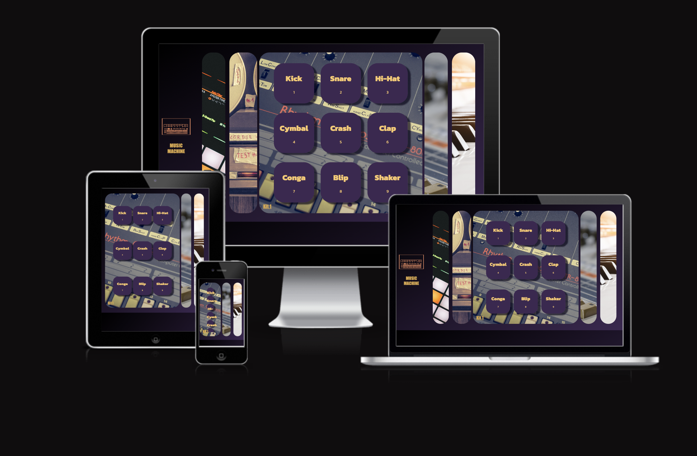

# MUSIC MACHINE

MUSIC MACHINE is a collection of downloadable instrument samples with a completely interactive and and playable interface using your phone, tablet or computer keyboard.

Users can enjoy the freedom to join in jam sessions when real drums or piano are not available.

The target audience is amatuers, young musicians and those who want access to drums or keybaords on the go.  

The site can be found here https://hayespace.github.io/Milestone2/

## UX

### User Stories

The user should: 
- Be able to navigate through the whole site smoothly with the five collapsible panels.
- Understand the purpose of the site upon loading.
- Play each individual sound using either a mouse, touch pad or computer keyboard.
- Access two drum libraries, a piano keybard and audio recorder.
- Hear the sounds clearly and without any latency
- Record and playback live audio from the devices microphone.
- The keys and button animations should respond to each click or key stroke.
- Plug the output into an external speaker for live performance.

### Design and Colour Scheme
- The site has been designed with one easy to navigate page.  
- 5 collapsible panels each conataining a high quality background image related to the content within that panel.
- Soft rounded edges on all buttons, panels and keys
- Dark color scheme on the main background with a mild transition from black to purple enabling the lighter images to pop off the screen.
- Floating button/ pads with a soft background shadow which changes colour when active.
- Each drum pad is labelled with the name of the sound and corresponding key letter
- Animated font which changes shape upon activation

## Features

### The 5 Panels
- Info panel which explains the purpose and site usecase.
- A simple audio recorder with a two buttons, REC and STOP, and an embedded player.
- A fully interactive drum sample library with 9 animated buttons which play a sample when clicked or played on the keyboard.
- A second drum sample library with 6 animated buttons and sounds
- A fully playable piano keyboard which can be played with mouse, touchpad or keybaord.

### Logo
- Simple png of a vintage drum machine 

### About
- The about page is a simple 4 paragraph text box on a floating semi-opaque background

### Audio Recorder
- Record audio from the devices micrphone directly to the site and playback with the integrated player

### Kit 1
- 9 animated drum pads activated by click, touch or keybard depending on the device

### Kit 2 
- 6 animated drum pads activated by click, touch or keybard depending on the device

### Piano
- Fully playable piano with animated keys activated by click, touch or keybard depending on the device

# Wirefame
The layout of the final site does not differ too much from the planned wireframes.  

The intention was always a single page with collapsible panels each containing a different instrument

## index.html

## Drums

## Piano

## Phone Index

## Phone Piano

# Technologies Used
- HTML5 - provides the content and structure for the website.
- CSS - provides the styling.
- Balsamiq - used to create the wireframes.
- JavaScript - For functionality including sounds and animation
- MediaStream JavaScript API for Audio Recorder https://developer.mozilla.org/en-US/docs/Web/API/MediaStream
- Native Instruments - For sample libraries
- Gitpod - used to deploy the website.
- Github - used to host and edit the website.
- JSLinter - Checking JS Code
- Nu Validator - Check HTML and CSS
- HTML Cleaner - Beautifying HTML, CSS and JS

# Testing

## User Stories

- Be able to navigate through the whole site smoothly with the five collapsible panels.
    - The site is very easy to navigate and the images contained within the panels offer a visual clue as to what the user can expext from each one.  As theres is only one page the user is never far away from the main obkective and points of interaction.
- Understand the purpose of the site upon loading.
    - From the drum machine logo with large label to the 5 panel images of drum machines, Piano, and tape recorder the user can quicly and easily inderstand that this is a site about music and making music.  The design of the piano keyboard is self explainatory, as are the drum pads with large labels and letters indicating which keys to press to engage with the content.
- Play each individual sound using either a mouse, touch pad or computer keyboard.
    - The pads and piano keys are both interactive and responsive.  They animate when clicked or pressed and the corresponding sound is triggered and played through the computer speakers.
- Access two drum libraries, a piano keybard and audio recorder.
    - Kit 1, Kit 2 and Piano are each contained within their own interactive panel.  Once the panel is open then the keys and buttons become fully functional and play the sounds contained within that specific library.
- Hear the sounds clearly and without latency
    - The samples are crisp a professional and recorded from actual instruments.  As they are high quality WAV files the audio is responsive and play swith near zero latency.
- Record and playback live audio from the devices microphone.
    - The Audio recoring panel will record sounds from either a built in or external micrphone source depending on the users setup.  Upon first interaction with the site the user will be asked to allow permission to connect to their device via their browser.
- The keys and button animations should respond to each click or key stroke.
  - Each key and button has been styled with colours and fonts to suit the sound library they represent.  The colours and shadows are bright and engaging.
- Plug the output into an external speaker for live performance.
  -  Users can use either the output of their device or bluetooth to connect to external speakers or recording device for live performance or recording.

## Validator Testing

- HTML - Errors found on index.html (Refer to Unfixed Bugs)
- CSS - No errors were found when passing through the official (Jigsaw) validator
http://jigsaw.w3.org/css-validator/validator$link

- JavaScript - 1 Error.  The arrow function does not need to be wrapped in parens so I have ignored the error here.

## Automated Test

   ### The Test
   I chose to write an automated test for the expanding cards by installing Jest.  The expanding cards work by adding and removing the 'active' class from the divs containing the panels.  When a user clicks on a panel, the active class is added to the div thereby expanding the panel and revealing the contents within.

   The test contained within panels.test.js checks the function removeActiveClasses with the following code.

    
1. Identifying the source 

        /** * @jest-environment jsdom */

        const { removeActiveClasses } = require('./script');

2. Describing the test        

        describe('removeActiveClasses', () => {
        test('should remove "active" class from all panels', () => {

3. Mocking the DOM
            
        document.body.innerHTML = `
        

        

        

        

        `;

3. Testing the Function        

        removeActiveClasses();
        const panels = document.querySelectorAll('.panel');

        panels.forEach(panel => {
        expect(panel.classList.contains('active')).toBe(false);
        };
   ### The Result

   ### FAIL!

   After several tutoring sessions, attempts to get an answer on Slack and going over the course material multiple times I was unable to get and answer as to why my test was returning reults for 'addEventListener', an entirely separate function, and not 'removeActiveClasses' as specified in the test.  

   While unable to get a satisfactory answer for the fail, I am satisfied that the test code is correct and that the issue may be with either the installation of Jest or an issue with distinguishing between multiple event listeners.

   
## Manual Testing 

Several layers of manual testing were required thoughout the build which included but not strictly limited to;

### Responsiveness 
As I intended for the site to be functional across multiple devices it was important to play the instruments from my phone and tablet and laptop with a smaller screen to ensure that the sounds were audible when played on a touch screen, playable and that the aesthetics of design weren't too diminished on smaller devices.
### Audio 
Several sample libraries were tested before being commited to the final project.  This included playing them from though exisitng music software like Logic Pro, Native Instruments and Itunes
### Microphone 
Manual testing to ensure that the microphone was accessible on different devices in order to capture audio with the recorder and that the audio could be played back.
### Keyboard 
As the instruments have been designed to be played with the computer keyboard it was necessary to test responsiveness of sounds based on which key was pressed and that there is little to no latency between striking the key and the intended sound.

## Issues Encountered and Resolved
### Responsiveness  
Responsiveness was one of the major issues throughout the entire build.  The nature of the panel styling meant that any small changes to the content and styling within a single panel had a knock-on effect across the entire site.

#### Fixes
        
- 5 media queries with size specific CSS detail for each panel based on the screen size
- Removing two panels by invoking display: none; in order to keep the screen neat and uncluttered.  I opted to remove the recorder for smaller devices such as phones as they have excellent out of the box audio recorders.  And the about page which i felt unecessary at that size.
- The additon of a scroll function for small sceens in order not to lose access to some of the drum pads on phone
- Flipping the Piano 90 degrees when on tablet or phone

- Removal of logo at smaller sizes to make room for the essesntial elements on the page
- Ongoing adjustments to padding, margins, flex box and other positions and styles

### Piano

While the main design for the keyboard was taken from a youtube tutorial the placement and adaption to the site was not without issues. 

- 

- ### Contact - Animated label transitionY
    - I followed a youtube tutorial which contained an animated label which sat within the input filed and glided up when text was entered into the text box.  The issue arose when clicking into the next field and the label would then glide down back into the box and obsure the newly entered text.
    - Fix - I could not find a way to get the label text to stay in place. So I removed the label completely and replaced with placeholder text.

### Original

### Fix

## Unfixed Bugs
- HTML Validator errors  - 
    - Element h1 not allowed as child of element button in this context. (Suppressing further errors from this subtree.) (15)
    - Element p not allowed as child of element button in this context. (Suppressing further errors from this subtree.) (15)

Only after getting to the end of my project and using the HTML validator did I realise that this might be a symantix issue.  A possible fix might be to change the buttons to divs with similar styling or write some JS code to place the h1 and p inside the button apon activating the panel.  But due to time constraints and the fact that within the context of this project it appears to function without any issues I have opted to leave as is.  Certainly not something I will do again in the future, however.

- Drum Kit buttons - After clicking a button and leaving the mouse hovering, then pressing the corresponding keyboard letter, a blue outline appears around the button.
        - I've looked over the CSS many times and can't find the source of the bug

# Deployment
The site was deployed to GitHub pages. 
- The live link can be found here - https://hayespace.github.io/Milestone2/

# Credits
All images contained within the panels were sourced from third party image sites, Drum machines and Piano inspiration taken from several youtube and Medium.com sources and then adapted to be fit for purpose.

## Content
- Panels - Inspiration for the collapsible panels was taken directly from 50 JS Projects in 50 Days 'Expanding Cards' lesson.
The core HTMl, CSS and JS are almost identical with the exception of some minor tweeks.  My own code is contained within the panels and the main challenges were adapting layout of the contents within the panels to be repsonsive and functional.

Some examples include:

- Adapting CSS and JS elements and functions to only work within an Active panel
- Writing several media queries for maximum responsiveness on smaller devices
- Several adjustments to CSS to ensure continuity across each panel even though the each contained different content

    - https://archive.org/details/50-projects-in-50-days-html-css-java-script_202207/02+Day+1+-+Expanding+Cards/006+Initial+Cards.mp4

- Drum Kits 1 & 2 - The code for the drums was inspired by several articles and a youtube video, of which, I adopted peices of code from each to modify into my own to service the project.  The main change was bringing keyboard and mouse played sounds together into the same project and piece of code.
    - https://dev.to/coderamrin/how-to-build-a-drum-kit-with-javascript-572b 
    - https://medium.com/@divyamcm/drum-kit-using-html-css-and-javascript-7e54a9f27544
    - https://medium.com/@iminked/build-a-drum-machine-with-javascript-html-and-css-33a53eeb1f73
    - https://www.youtube.com/watch?v=SBvn8FuylBg

- Piano - The CSS design and layout of the keyboard was taken directly from the following youtube video as I really liked the design and it's simplicity.  I did however, discard the JavaScript and write my own by adapting the Drum kit code.
    - https://www.youtube.com/watch?v=mjmh093Sucg

- Recorder - Primary JS was taken from and trimmed down with custom CSS
    - https://developer.mozilla.org/en-US/docs/Web/API/MediaStream_Recording_API/Using_the_MediaStream_Recording_API

## Media

- Logo and Photos are Adobe Express stock Images.
- The logo is slightly modified with Adobe Express to create a tranparent background and colour change
- Font from Google fonts

